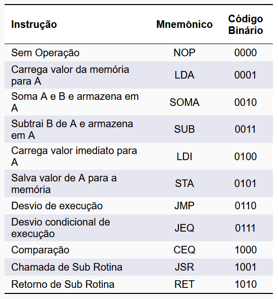
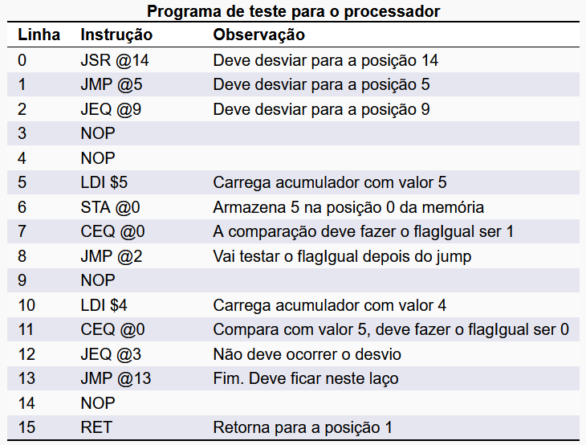
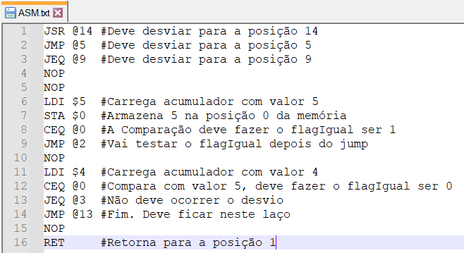
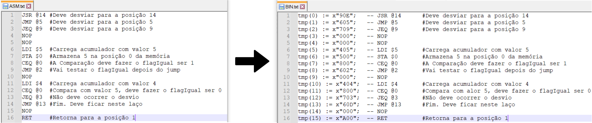

# Assembler

Questão: Como criar um montador (assembler) utilizando python ?

## Objetivos

Implementar um programa em linguagem python que traduz seu código assembly em linguagem de máquina do processador desenvolvido na disciplina Design de Computadores - Engenharia de Computação (INSPER).

## Contextualização

Os programas para computadores ao longo do tempo se tornaram cada vez mais complexos, com isso surgiu a necessidade de simplificar a escrita desses programas. Para isso foi criado a linguagem assembly, uma linguagem que através de mnemônicos permite programar o software que será implementado em um computador.

Cada arquitetura possui seu próprio código de máquina, por isso, não existe uma padronização da linguagem assembly, tornando dificultoso a portabilidade do código. Para este estudo guiado usaremos a arquitetura acumulador e o assembly desenvolvido na disciplina de Design de Computadores (2022a ~ 2022b) do curso de Engenharia de Computação do INSPER.

**OBS:** Para fins de simplificação foi considerado todos os imediatos como 8  bits, alterando assim um pouco o **Fluxo de Dados** (alterações em laranja) e o **Formato das instruções**


### 1. Fluxo de Dados - Arquitetura Baseada em Acumulador


### 2. Formato das Instruções


### 3. Mnemônicos - Arquitetura Baseada em Acumulador




### 4. Programa de teste





### 5. Arquivo "ASM.txt" com o programa teste




## Funcionamento

O Assembler desenvolvido em python (AssemblerASM_BIN_VHDL.py) irá traduzir a linguagem assembly (contida no arquivo ASM.txt) em linguagem de máquina pronta para ser utilizada no módulo memoriaROM do processador desenvolvido em VHDL (contida no arquivo BIN.txt).





### 1. Definição dos arquivos

```python
assembly = 'ASM.txt' #Arquivo de entrada que contém o assembly
destinoBIN = 'BIN.txt' #Arquivo de saída que contém o binário formatado para VHDL
```


### 2. Definição dos mnemônicos, utilizando dicionário

```python
#definição dos mnemônicos e seus
#respectivos OPCODEs (em Hexadecimal)
mne =	{ 
       "NOP":   "0",
       "LDA":   "1",
       "SOMA":  "2",
       "SUB":   "3",
       "LDI":   "4",
       "STA":   "5",
       "JMP":   "6",
       "JEQ":   "7",
       "CEQ":   "8",
       "JSR":   "9",
       "RET":   "A",
}
```

### 3. Funções de conversão

```python
#Converte o valor após o caractere arroba '@'
#em um valor hexadecimal de 2 dígitos (8 bits)
def  converteArroba(line):
    line = line.split('@')
    line[1] = hex(int(line[1]))[2:].upper().zfill(2)
    line = ''.join(line)
    return line
 
#Converte o valor após o caractere cifrão'$'
#em um valor hexadecimal de 2 dígitos (8 bits) 
def  converteCifrao(line):
    line = line.split('$')
    line[1] = hex(int(line[1]))[2:].upper().zfill(2)
    line = ''.join(line)
    return line
        
#Define a string que representa o comentário
#a partir do caractere cerquilha '#'
def defineComentario(line):
    if '#' in line:
        line = line.split('#')
        line = line[0] + "\t#" + line[1]
        return line
    else:
        return line

#Remove o comentário a partir do caractere cerquilha '#',
#deixando apenas a instrução
def defineInstrucao(line):
    line = line.split('#')
    line = line[0]
    return line
    
#Consulta o dicionário e "converte" o mnemônico em
#seu respectivo valor em hexadecimal
def trataMnemonico(line):
    line = line.replace("\n", "") #Remove o caracter de final de linha
    line = line.replace("\t", "") #Remove o caracter de tabulacao
    line = line.split(' ')
    line[0] = mne[line[0]]
    line = "".join(line)
    return line
```

### 3. Sequência de conversão

```python
with open(assembly, "r") as f: #Abre o arquivo ASM
    lines = f.readlines() #Verifica a quantidade de linhas
    
    
with open(destinoBIN, "w") as f:  #Abre o destino BIN

    cont = 0 #Cria uma variável para contagem
    
    for line in lines:        
        
        #Verifica se a linha começa com alguns caracteres invalidos ('\n' ou ' ' ou '#')
        if (line.startswith('\n') or line.startswith(' ') or line.startswith('#')):
            line = line.replace("\n", "")
            print("-- Sintaxe invalida" + ' na Linha: ' + ' --> (' + line + ')') #Print apenas para debug
        
        #Se a linha for válida para conversão, executa
        else:
            
            #Exemplo de linha => 1. JSR @14 #comentario1
            comentarioLine = defineComentario(line).replace("\n","") #Define o comentário da linha. Ex: #comentario1
            instrucaoLine = defineInstrucao(line).replace("\n","") #Define a instrução. Ex: JSR @14
            
            instrucaoLine = trataMnemonico(instrucaoLine) #Trata o mnemonico. Ex(JSR @14): x"9" @14
                  
            if '@' in instrucaoLine: #Se encontrar o caractere arroba '@' 
                instrucaoLine = converteArroba(instrucaoLine) #converte o número após o caractere Ex(JSR @14): x"9" x"0E"
                    
            elif '$' in instrucaoLine: #Se encontrar o caractere cifrao '$' 
                instrucaoLine = converteCifrao(instrucaoLine) #converte o número após o caractere Ex(LDI $5): x"4" x"05"
                
            else: #Senão, se a instrução nao possuir nenhum imediator, ou seja, nao conter '@' ou '$'
                instrucaoLine = instrucaoLine.replace("\n", "") #Remove a quebra de linha
                instrucaoLine = instrucaoLine + '00' #Acrescenta o valor x"00". Ex(RET): x"A" x"00"
                
            
            line = 'tmp(' + str(cont) + ') := x"' + instrucaoLine + '";\t-- ' + comentarioLine + '\n'  #Formata para o arquivo BIN
                                                                                                       #Entrada => 1. JSR @14 #comentario1
                                                                                                       #Saída =>   1. tmp(0) := x"90E";	-- JSR @14 	#comentario1
                                        
            cont+=1 #Incrementa a variável de contagem, utilizada para incrementar as posições de memória no VHDL
            f.write(line) #Escreve no arquivo BIN.txt
            
            print(line,end = '') #Print apenas para debug
```

## Atividade:

Criar um programa em assembly no arquivo **ASM.txt** e executar o código python  **AssemblerASM_BIN_VHDL** para a arquitetura da Aula5

